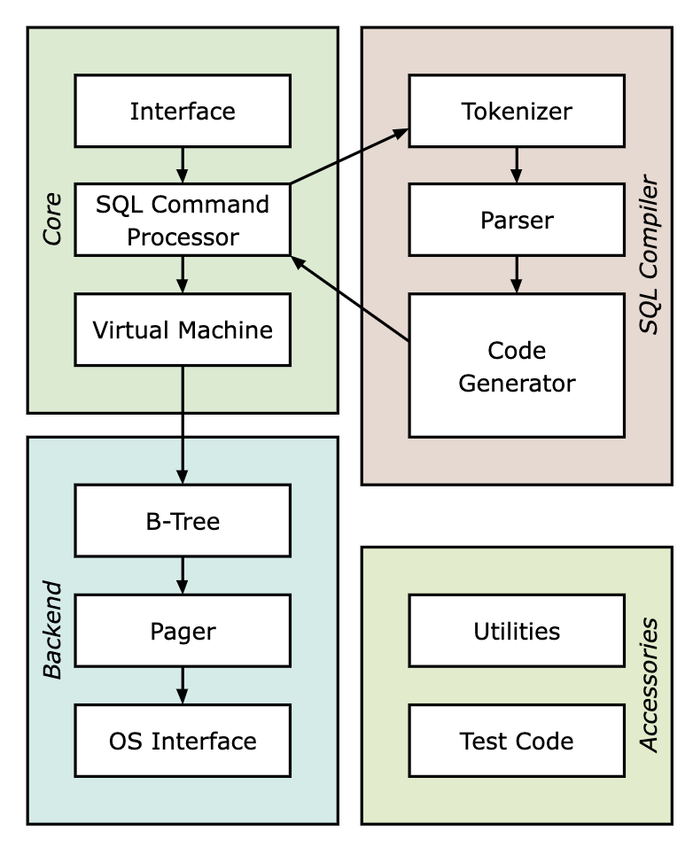

## tinydb

  

A tiny and dummy database built by myself.


## Introdution

This project is inspired by sqlite, has a similar architecture with sqlite (but simpler).



- `tinydb` is the simplest prototype of database, it only contains **ONE** table (see `table_t` and `row_t` in source file `types.h`), whose schema is `id(uint32_t), username(string), email(string)` .
- `id(int)` is the primary key of our table, we will implement index via B+Tree.


There are two version of `tinydb`:

- `main.c` - In this program, I parse the SQL statements by spliting strings, thus the SQL statements are incomplete. And it does **NOT** support `where` keyword.
- `main2.c` - In this program, I implement an tiny SQL Parser based on Flex & Bison, thus the SQL statements in this program are mostly like sqlite or MySQL. And it supports `where` conditions.

For both of them, they have the same format of database file.


## Build `main.c`

This project has only one `.c` file. And you can build it by:

```text
make dummy
./tinydb mydb.db
```

And it will enter our REPL (Read, Evaluate, Print, Loop) program:

```text
tinydb > insert 1 1 1
Executed.
tinydb > insert 2 2 2
Executed.
tinydb > insert 3 3 3
Executed.
tinydb > update 1 a a
Executed.
tinydb > delete 3
Executed.
tinydb > select
(1, a, a)
(2, 2, 2)
total 2 rows
Executed.
tinydb > 
```

From so far, `tinydb` supports these sql statement:

- `insert`
- `select`
- `delete`
- `update`
- `commit`
- `rollback`

And it also support some meta commands (for debugging):

- `.help`
- `.exit`
- `.constants`
- `.btree`


## Build `main2.c`

```bash
make build
./tinydb mydb.db
```

In this program, I implement a SQL Parser. It will support SQL statements like:

- `SELECT * FROM table;`
- `SELECT col1, col2 FROM table;`
- `SELECT * FROM table WHERE conditions;`
- `SELECT col1, col2 FROM table WHERE conditions;`
- `INSERT INTO table VALUES (NUMBER, STRING, STRING);`
- `DELETE FROM table WHERE conditions;`
- `UPDATE table SET col1 = val1, col2 = val2;`
- `COMMIT;`
- `ROLLBACK;`

For the above keywords, we can also use lower cases: `select, insert, delete, update, ...`

Please note that there is a `';'` after each SQL statement.

And the `conditions` support operators: `=, !=, >=, >, <=, <, AND, OR`, e.g.

```sql
SELECT * FROM table WHERE id < 10 OR id > 100 AND username = 'sinkinben';
SELECT * FROM table WHERE id = 1 AND username='1' OR id >= 10 AND id < 20;
SELECT * FROM table WHERE id = 1 AND username='1' OR id >= 10 AND username < '20';
```

The keywords `AND, OR` can be `and, or`.

Here is an example, showing how to use `tinydb`.

```text
tinydb > insert into table values (1, 'sinkinben', 'skb@qq.com');
Executed.
tinydb > select * from table where id=1 and username='sinkinben';
id = 1 username = sinkinben email = skb@qq.com
total 1 rows
Executed.
tinydb > update table set email='sinkinben@outlook.com' where id=1;
Executed.
tinydb > select * from table;
(1, sinkinben, sinkinben@outlook.com)
total 1 rows
Executed.
tinydb > .exit
```


## Running Test

```bash
mv gemfile Gemfile  # rename Gemfile
bundle install
bundle exec rspec
```

Running this testing script, will fill the database file `mydb.db` with dummy data (total 6000 rows).


## Recommend Readings

- [1] [SQLite Database System: Design and Implementation](https://play.google.com/store/books/details/SQLite_Database_System_Design_and_Implementation_F?id=9Z6IQQnX1JEC&gl=US)
- [2] [Architecture of SQLite](https://www.sqlite.org/arch.html)
- [3] https://github.com/cstack/db_tutorial

